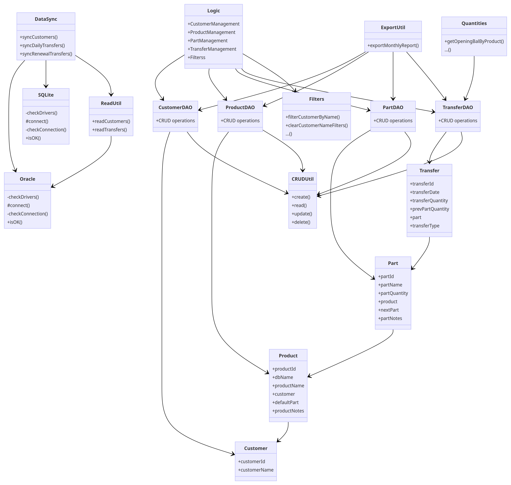

---

## Table of Contents

- [Table of Contents](#table-of-contents)
- [Setting Up](#setting-up)
  - [Prerequisites](#prerequisites)
  - [Configuration](#configuration)
- [Design](#design)
  - [Architecture](#architecture)
  - [Databases](#databases)
    - [Oracle](#oracle)
    - [SQLite](#sqlite)
  - [Models](#models)
    - [Customer](#customer)
    - [Product](#product)
    - [Part](#part)
    - [Transfer](#transfer)
  - [Logic](#logic)
    - [Data Synchronization](#data-synchronization)
    - [Data Access Objects](#data-access-objects)
    - [Filters](#filters)
    - [Management](#management)
    - [Quantities](#quantities)
    - [Export Util](#export-util)
  - [UI](#ui)
    - [Component](#component)
    - [MainWindow](#mainwindow)
    - [Action Bar](#action-bar)
    - [Tables](#tables)
    - [Input Bar](#input-bar)
    - [Info Bar](#info-bar)

## Setting Up

### Prerequisites

- Java 8 (Use any suitable JDK version)
- Gradle (Use any suitable build tool e.g. Maven)
- JDBC drivers
  - org.xerial:sqlite-jdbc:3.42.0.0
  - com.oracle.database.jdbc:ojdbc8:23.2.0.0
- Apache Commons CSV
  - org.apache.commons:commons-csv:1.10.0

### Configuration

- Database connection details (found in `oracle.properties`)
  - `oracle.username`: Oracle database username
  - `oracle.password`: Oracle database password
  - `oracle.url`: Oracle database URL
  - `sqlite.location`: SQLite database location
  - `export.location`: Exported CSV file location
  - `enable_offline`: Enable offline mode (true/false)

## Design

### Architecture

The diagram below shows the architecture of the application.

The application is split into 4 main components: databases, models, logic, and UI.

### Databases

The application connects to 2 databases: Oracle and SQLite. The Oracle database is where the company stores its data. The SQLite database is used to store the application's data.

#### Oracle

The class `Oracle` is used to connect to the Oracle database. It uses the JDBC driver to connect to the database. The class `Oracle` is a singleton class, which means that there is only one instance of the class. This is to ensure that there is only one connection to the database at any time.

Its class methods are used to validate the connection upon data synchronization.

The class `ReadUtil` contains methods to read data from the Oracle database. It uses the `Oracle` class to connect to the database and execute queries.

#### SQLite

The class `Database` is used to connect to the SQLite database. It uses the JDBC driver to connect to the database. The class `Database` is a singleton class, which means that there is only one instance of the class. This is to ensure that there is only one connection to the database at any time.

Its class methods are used to validate the connection upon startup, data synchronization and user operations.

The class `CRUDUtil` contains methods to create, read, update, and delete data from the SQLite database. It uses the `Database` class to connect to the database and execute queries.

### Models

The models are used to represent the data in the application. The models are used to store data from the databases and to pass data between the logic and UI components.

#### Customer

The `Customer` class represents a customer. It contains the following attributes: `customerId`, `customerName`.

Each `Customer` object is mapped to a row in the `customer` table in the SQLite database and a row in the `customer` table in the Oracle database.

#### Product

The `Product` class represents a product. It contains the following attributes: `productId`, `dbName`, `productName`, `customer`, `defaultPart`, `productNotes`.

Each `Product` object is mapped to a row in the `product` table in the SQLite database and a row in the `product` table in the Oracle database.

The database name (`dbName`) is used to identify the product alias from the SQL query results and retrieved from the Oracle database. The product name (`productName`) is used to identify the product alias from the user input. Both the database name and product name are used to identify the product from the SQLite database.

The `customer` attribute is a `Customer` object that represents the customer that the product belongs to. The `defaultPart` attribute is a `Part` object that represents the default part for the product. The `productNotes` attribute is a `String` that represents the notes for the product set by the user.

When a `Product` object is created, the `customer` is necessary. The `defaultPart` is initialized to a new `Part` object `Default`. Both `productName` and `productNotes` are initialized to empty strings.

#### Part

The `Part` class represents a part. It contains the following attributes: `partId`, `partName`, `partName`, `partQuantity`, `product`, `nextPart`, `partNotes`.

Each `Part` object is mapped to a row in the `part` table in the SQLite database and a row in the `part` table in the Oracle database.

The `partQuantity` attribute is an `int` that represents the quantity of the part. The `product` attribute is a `Product` object that represents the product that the part belongs to.

The `nextPart` attribute is a `Part` object that represents the next part to be used for the product starting from the default part.

The `partNotes` attribute is a `String` that represents the notes for the part set by the user.

When a `Part` object is created, the `product` is necessary. The `partQuantity` is initialized to 0. The `nextPart` is initialized to `null`. The `partNotes` is initialized to an empty string.

#### Transfer

The `Transfer` class represents a transfer. It contains the following attributes: `transferId`, `transferDate`, `transferQuantity`, `prevPartQuantity`, `part`, `transferType`.

Each `Transfer` object is mapped to a row in the `transfer` table in the SQLite database and a row in the `transfer` table in the Oracle database.

The `part` attribute is a `Part` object that represents the part that the transfer belongs to. The `transferType` attribute is a `String` that represents the type of the transfer: `RECEIVED`, `WITHDRAW`, `REJECT`, `SAMPLE`.

The `transferDate` attribute is a `Date` object that represents the date of the transfer. The `transferQuantity` attribute is an `int` that represents the quantity of the transfer. The `prevPartQuantity` attribute is an `int` that represents the quantity of the part before the transfer to facilitate quantity operations.

When a `Transfer` object is created, the `part` is necessary. The `transferDate` is initialized to the current date. The `transferQuantity` is given by user input. The `prevPartQuantity` is initialized to the current quantity of the part.

### Logic

The `Logic` class serves as the interface between the UI and the underlying data access objects, filters, and data synchronization classes. It is responsible for interacting with the management classes to handle various operations for each data model mentioned above. This class also provides the necessary quantitative data and table view modifications for display.

When initialised, the `Logic` creates and stores every sublogic class, comprising of:

1. Filters
2. CustomerManagement
3. ProductManagement
4. PartManagement
5. TransferManagement

Data access objects, data synchronization, quantities, and export are statically accessible.

#### Data Synchronization

The `DataSync` class is used to synchronize data between the Oracle and SQLite databases. It uses the `Oracle` and `Database` classes to connect to the databases and the `ReadUtil` and `CRUDUtil` classes to read and write data to the databases.

From the Oracle database, the `DataSync` class retrieves the following data: customers, product names, and work order quantities. The data is then remodeled into the following data: customers, products, parts and transfers by referencing the current default part in the SQLite database. The data access objects are then inserted or updated to the SQLite database and stored in lists.

Synchronisation is separated into 3 main methods: `syncCustomers`, `syncDailyTransfers`, and `syncRenewalTransfers`. This facilitates future synchronisation requirements by reducing coupling. 

#### Data Access Objects

The `CustomerDAO`, `ProductDAO`, `PartDAO`, and `TransferDAO` classes are used to handle CRUD operations for each data model mentioned above. They use the `CRUDUtil` class to connect to the SQLite database and execute queries. They are responsible for reading and writing data to the SQLite database.

Each data access object contains a list of the corresponding data model. The list is used to store the data retrieved from the SQLite database. The list is also used to store the data retrieved from the Oracle database during data synchronization. The list is then used to update the SQLite database during data synchronization.

These data object objects are mostly utilised by the management classes to handle user operations. They are also used in the data synchronization and export processes.

#### Filters

The `Filter` class is used to filter data from the data access objects. It is used to filter data by customer name, product/part name, and transfer date/type.

Each filter has a setter method and a clear method e.g. `filterCustomerByName()`, `clearCustomerNameFilter()`. These filters make use of `ObjectProperty` to bind changes in multiple `Predicate` objects to the `ObservableList` corresponding to each DAO model. Any changes to the filters are reflected in the list of the corresponding data model in the data access objects and is reflected in the UI.

#### Management

The `CustomerManagement`, `ProductManagement`, `PartManagement`, and `TransferManagement` classes are used to handle any user operations which involve CRUD and filtering operations. These classes interact with DAO and filters while ensuring relationships between the models are maintained.

Each management object is initialised with the relevant data access object and filter. The management objects are then referenced by the `Logic` class to handle user operations.

#### Quantities

The `Quantities` class is used to handle quantity operations for each data model mentioned above. It is used to calculate the total quantity of parts and transfers for each product given a date range.

Since each method makes use of the `TransferDAO` class and stream operations, the amount of transfers may increase the time taken for calculations linearly. However, the time taken is still negligible for the current amount of data. A possible future solution is to cache the results of the calculations.

#### Export Util

The `ExportUtil` class is used to export data from the SQLite database to a CSV file. It uses the Apache Commons CSV library to write data to the CSV file.

The following columns are exported:

1. Customer Name
2. Product Name
3. Part Name
4. Opening Balnce
5. Sample
6. Received
7. Daily (Output) 
8. Daily (Reject)
9. Renewal (Output)
10. Renewal (Reject)
11. Project (Reject)
12. Closing Balance

### UI

The UI is implemented with JavaFX and FXML. The basic layout is a BorderPane with a action bar at the top, an input bar at the bottom, and 3 table views in the center. The table views are used to display the data from the data access objects.

#### Component

The `Component` class is used to represent a component in the UI. It initializes the component with the relevant FXML file and controller. It also provides methods to retrieve the FXML file and controller root.

#### MainWindow

The `MainWindow` class is used to initialize the UI. It uses the `Logic` class to retrieve data from the data access objects and fills placeholders in the FXML file with the relevant components.

#### Action Bar

The `ActionBar` is used to handle user CRUD and synchronization operations. It uses the `Logic` class to handle the operations and the `InputBar` component to retrieve user text input.

It consists of the following buttons: `addCustomerButton`, `addProductButton`, `addPartButton`, `addTransferButton`, `syncButton`, `deleteButton`, synchronisation date picker `syncDate`, transfer date range pickers `startDatePicker`, `endDatePicker`, and `exportButton`.

The `addCustomerButton`, `addProductButton`, `addPartButton`, `addTransferButton` buttons are used to add a new customer, product, part, and transfer respectively. The `syncButton` button is used to synchronize data between the Oracle and SQLite databases given a user input date. The `deleteButton` button is used to delete a customer, product, part, or transfer. The `syncDate` date picker is used to select a date for data synchronization.

The 'startDatePicker' and 'endDatePicker' date pickers are used to select a date range for filtering transfers and displaying the total quantity of transfers in the date range. The `exportButton` button is used to export the data in the table views to a CSV file according to the indicated date range.

#### Tables

The table view classes `CustomerTable`, `ProductPartTable`, and `TransferTable` are used to display the data from the data access objects. The `Logic` class handles any data modifications and filtering operations.

The `CustomerTable` displays the following columns: `customerName`. The `TextField` in the `customerName` column is used to filter the data by customer name. The table items are bound to the `ObservableList` in the `CustomerDAO` class.

The `ProductPartTable` displays the following columns: `dbName`, `productName`/`partName`, `quantity`. The `TextField` above the tree table view is used to filter the data by product/part name. The table is not bound to the `ObservableList` in the `ProductDAO` and `PartDAO` classes because the tree table view requires `TreeItem` objects with parent-child relationships and different data types are displayed in the same columns. Hence, the `rebuild()` method is used to rebuild the tree table view with the filtered data after every change in the product/part lists and object properties.

The `TransferTable` displays the following columns: `transferDate`, `transferType`, `transferQuantity`. The `TextField` above the table view is used to filter the data by transfer date/type. The table items are bound to the `ObservableList` in the `TransferDAO` class.

#### Input Bar

The `InputBar` component is used to retrieve user text input. It consists of the following optional components: `nameInput`, `qtyInput`, `actionInput`, `saveBtn`, `confirmBtn`, `cancelBtn`.

The `nameInput` is enabled for adding new customers, products, and parts. The `qtyInput` is enabled for adding new parts and transfers. The `actionInput` is enabled for adding new transfers. The `saveBtn` is enabled for adding new customers, products, parts, and transfers. The `confirmBtn` and `cancelBtn` are enabled for deleting customers, products, parts, and transfers.

Each of these user operations are triggered with the `ActionBar` and handled by the `Logic` class.

#### Info Bar

The `InfoBar` component is used to display information to the user. It consists of the following components: `customerInfo`, `productDetails`, `startDatePicker`, `endDatePicker`.

The `customerInfo` is used to display the selected customer's opening/closing balances and inventory change. The `productDetails` is used to display the selected product/part's opening/closing balances and transfer totals.
