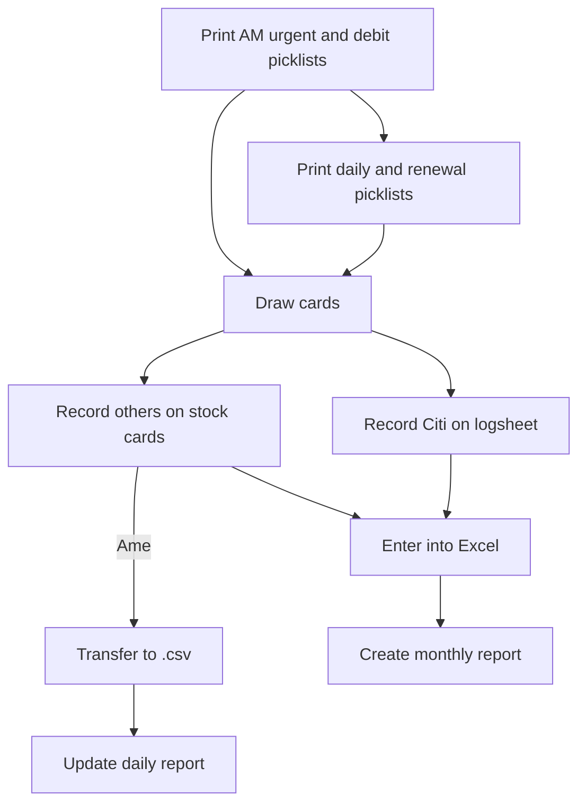

# Inventory Management

Under perso banking production, the vault team consisting of 2-3 material handlers handle the drawing and recording of card and mailing stock. The current system has an excessive paper trail and unnecessary manual data entry.

## Current Logistics Process

### Picklist

Material handlers print separate customer order lists, separated into daily, urgent, debit, and renewal orders. The lists are produced using iReport querying the bank order database and formatting the information as a JasperReport. The required inventory is sorted by different orders and make it difficult to retrieve cards of the same customer/type at one go.

The AM urgent and debit orders are prioritised first to get production started as soon as possible. The daily orders are fulfilled throughout the day and renewal orders are left for the end. PM urgent orders come in at 3pm.

### Inventory logging

The inventory is currently separated into more accessible working stock, and vault inventory.

Companies have different logging requirements.

- Citibank: monthly report
- Amex: daily report

Citibank card usage is written on a logsheet printed along with the picklist.

Amex card usage is recorded on indivdual stock cards and entered into an excel workbook over the course of the day. The count is then cross-checked against JMS for verification.

Jobs which are rejected and redone during production are also manually accounted for.

## Consequences

### Human error-prone

Repeated data entries is highly susceptible to mistakes given the high-intensity environment along with lack of secondary checks. Though the vault team does check the physical inventory count against recorded inventory, it is often difficult to pinpoint the reasons in discrepancies and correct them.

### Production efficiency

It is essential that materials are distributed to operators quickly to maintain constant production over the workday. A significant portion of the withdrawal process is spent on notetaking. Unnecessary stock processing takes up a lot of bandwidth and serves as a bottleneck for day-to-day production.

## Product requirements

### Functional

| As an operator... |
|------|
| I want to view a list of customers |
| I want to view the card type corresponding to each customer product|
| I want to view the amount of cards received in |
| I want to view the amount of cards drawn out |
| I want to view the beginning and ending card balances|
| I want to have daily usage records |
| I want to record rejected cards to record inventory |
| I want to export inventory logs into company-designed formats|
| I want the stock report to update with daily orders |

### Non-functional

1. Windows OS
2. No web-based platform
3. No need to migrate previous Excel data

## Solutions

### 1: Scripting with iReport/Automate (Java)

#### Upsides

- Convenient automated process
- Existing templates
- Familiar use (just running of scripts)

#### Features

  1. Consolidate customer orders into card types
  2. Indicate custom cards clearly
  3. Automate printing for each workday

### 2a: Excel macros

#### Upsides

- Familiar interface
- Existing software
- Faster adoption

#### Downsides

- More verbose and unwieldy VBA program
- Less scalable (difficult to update and fix errors)
- Prone to unintended changes

#### Features

  1. Update workbook from database with customer orders
  2. Record scrapped/rejected cards
  3. Automated reports
     1. Stock report formatting
     2. Updating of amex daily

### 2b: Java App

#### Upsides

- Cohesive experience
- Easier to link with database
- More functionality (GUI)

#### Downsides

- Less maintainable (concerns over who can take over regular maintenance)
- Takes longer to produce
- Subject to approval
- Requires memory/storage

#### Features

1. View any customer stock
2. Update stock by receive, sample, out, reject
3. View opening/closing balances
4. GUI for simplifying user input and interactions
5. Database for efficient storage

## Evaluation

Picklist printing is a simple task that can be easily automated. The current process is already automated and can be further improved with a script to print the picklists for each workday.

For inventory logging, I have decided to go with the Java app as it is the most comprehensive solution. It is also the most challenging and time-consuming to produce, but I believe it will be a good learning experience.

The Java app will be able to handle all the requirements and more. It will be able to handle the following:

- Consolidate customer orders into product, part, and transfer types
- Display stock balances by different time periods (daily, monthly, yearly)
- Modify stock balances by receive, sample, out, reject
- Export stock reports in company formats

## Resources

- [User Guide](/User%20Guide.md)
- [Developer Guide](/Developer%20Guide.md)
