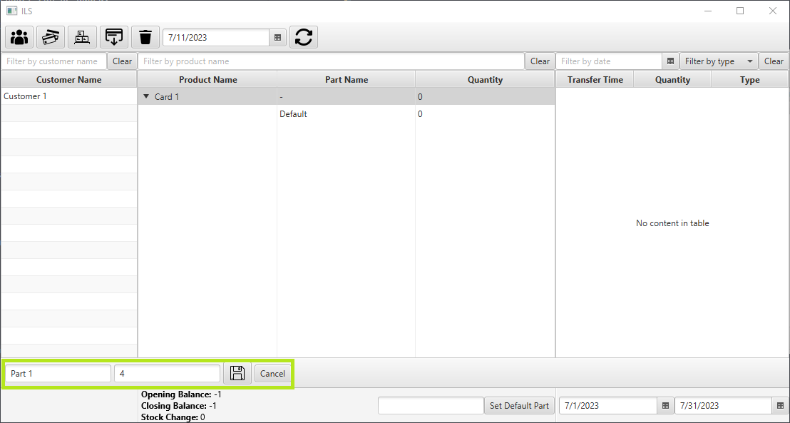
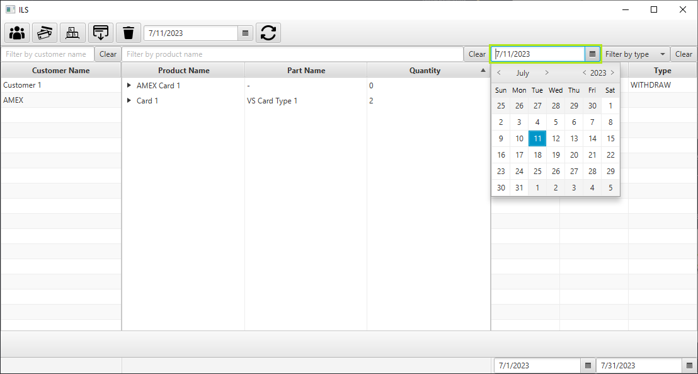

---

## Table of Contents

- [Table of Contents](#table-of-contents)
- [Quick Start](#quick-start)
- [Features](#features)
  - [Adding a customer](#adding-a-customer)
  - [Adding a product](#adding-a-product)
  - [Adding a part](#adding-a-part)
  - [Adding a transfer](#adding-a-transfer)
  - [Editing product names](#editing-product-names)
  - [Editing part names](#editing-part-names)
  - [Deleting a customer](#deleting-a-customer)
  - [Deleting a product](#deleting-a-product)
  - [Deleting a part](#deleting-a-part)
  - [Deleting a transfer](#deleting-a-transfer)
  - [Filtering customers by name](#filtering-customers-by-name)
  - [Filtering products/parts by name](#filtering-productsparts-by-name)
  - [Filtering transfers by date](#filtering-transfers-by-date)
  - [Filtering transfers by type](#filtering-transfers-by-type)
  - [Data Synchronization](#data-synchronization)
  - [Customer Statistics](#customer-statistics)
  - [Product/Part Statistics](#productpart-statistics)
  - [Setting default part for a product](#setting-default-part-for-a-product)
  - [Editing product/part notes](#editing-productpart-notes)

## Quick Start

1. Ensure you have Java 8 or below installed. Check by running `java -version` in the command line.

2. Download the latest release of the application.

3. Create a folder `/database` in the same directory as the application.

4. Open the application by double-clicking on it or running `java -jar ILS.jar` in the command line. You should see the following window:

5. Mouse over each of the buttons on the action bar to see what they do.

6. Click on the `Sync` button to synchronize the application's database with the company's database. You should see the following window:

7. Try out the different filters to see how they work.

---

## Features

### Adding a customer

To add a customer, click on the `Add Customer` button on the action bar. The section is highlighted in the image below:

An input box will appear. Enter the customer's name and click on the `Save` button. The section is highlighted in the image below:

A new customer will be added to the table.

### Adding a product

To add a product, click on the `Add Product` button on the action bar. The section is highlighted in the image below:

An input box will appear. Enter the product's name and click on the `Save` button. The section is highlighted in the image below:

Note that a customer must be selected before a product can be added.

A new product will be added to the table along with a default part.

### Adding a part

To add a part, click on the `Add Part` button on the action bar. The section is highlighted in the image below:

An input box will appear. Enter the part's name and quantity, then click on the `Save` button. The section is highlighted in the image below:

Note that a product must be selected before a part can be added.

A new part will be added to the table.

### Adding a transfer

To add a transfer, click on the `Add Transfer` button on the action bar. The section is highlighted in the image below:

An input box will appear. Enter the transfer's quantity and type, then click on the `Save` button. The section is highlighted in the image below:

Note that a part must be selected before a transfer can be added.

A new transfer will be added to the table.

### Editing product names

To edit a product's name, simply double-click on the product's name in the table. The section is highlighted in the image below:

To save the changes, press the `Enter` key on your keyboard.

### Editing part names

To edit a part's name, simply double-click on the part's name in the table. The section is highlighted in the image below:

To save the changes, press the `Enter` key on your keyboard.

### Deleting a customer

To delete a customer, select the customer in the table and click on the `Delete` button on the action bar. The section is highlighted in the image below:

A confirmation box will appear. Click on the `Yes` button to confirm the deletion. The section is highlighted in the image below:

Note that deleting a customer will also delete all the products, parts and transfers associated with the customer.

### Deleting a product

To delete a product, select the product in the table and click on the `Delete` button on the action bar. The section is highlighted in the image below:

A confirmation box will appear. Click on the `Yes` button to confirm the deletion. The section is highlighted in the image below:

Note that deleting a product will also delete all the parts and transfers associated with the product.

### Deleting a part

To delete a part, select the part in the table and click on the `Delete` button on the action bar. The section is highlighted in the image below:

A confirmation box will appear. Click on the `Yes` button to confirm the deletion. The section is highlighted in the image below:

### Deleting a transfer

To delete a transfer, select the transfer in the table and click on the `Delete` button on the action bar. The section is highlighted in the image below:

A confirmation box will appear. Click on the `Yes` button to confirm the deletion. The section is highlighted in the image below:

### Filtering customers by name

To filter customers by name, enter the name in the search box shown below:

The table will be updated to show only customers whose names contain the search term.

To clear the filter, click on the `Clear` button next to the search box.

### Filtering products/parts by name

To filter products/parts by name, enter the name in the search box shown below:

The table will be updated to show only products/parts whose names contain the search term.

To clear the filter, click on the `Clear` button next to the search box.

### Filtering transfers by date

To filter transfers by date, select a date using the datepicker shown below:

The table will be updated to show only transfers that occurred on the selected date.

To clear the filter, click on the `Clear` button next to the datepicker.

### Filtering transfers by type

To filter transfers by type, select the type in the dropdown box shown below:

The table will be updated to show only transfers of the selected type.

To clear the filter, click on the `Clear` button next to the dropdown box.

### Data Synchronization

The application synchronizes its database with the company's JMS database. This is done by comparing the data in the application's database with the data in the company's database. The application then updates its database with the latest data from the company's database.

To synchronize the application's database with the company's database, select a date using the datepicker and click on the `Sync` button on the action bar. The section is highlighted in the image below:

### Customer Statistics

The application displays statistics for the selected customer. The statistics are displayed below the table. The section is highlighted in the image below:

The statistics are updated whenever a customer is selected.

The date range for the statistics can be changed by selecting a start date and end date using the datepickers shown below:

### Product/Part Statistics

The application displays statistics for the selected product/part. The statistics are displayed below the table. The section is highlighted in the image below:

The statistics are updated whenever a product/part is selected.

The date range for the statistics can be changed by selecting a start date and end date using the datepickers shown below:

### Setting default part for a product

To set the default part for a product, select the part in the table and click on the `Set Default Part` at the bottom bar. The section is highlighted in the image below:

The part will be set as the default part for the product and the previous default part will be changed to the next available part.

### Editing product/part notes

To edit a product/part's notes, select the product/part in the table and type the notes in the text area at the bottom bar. The section is highlighted in the image below:

Press the `Enter` key on your keyboard to save the changes.
